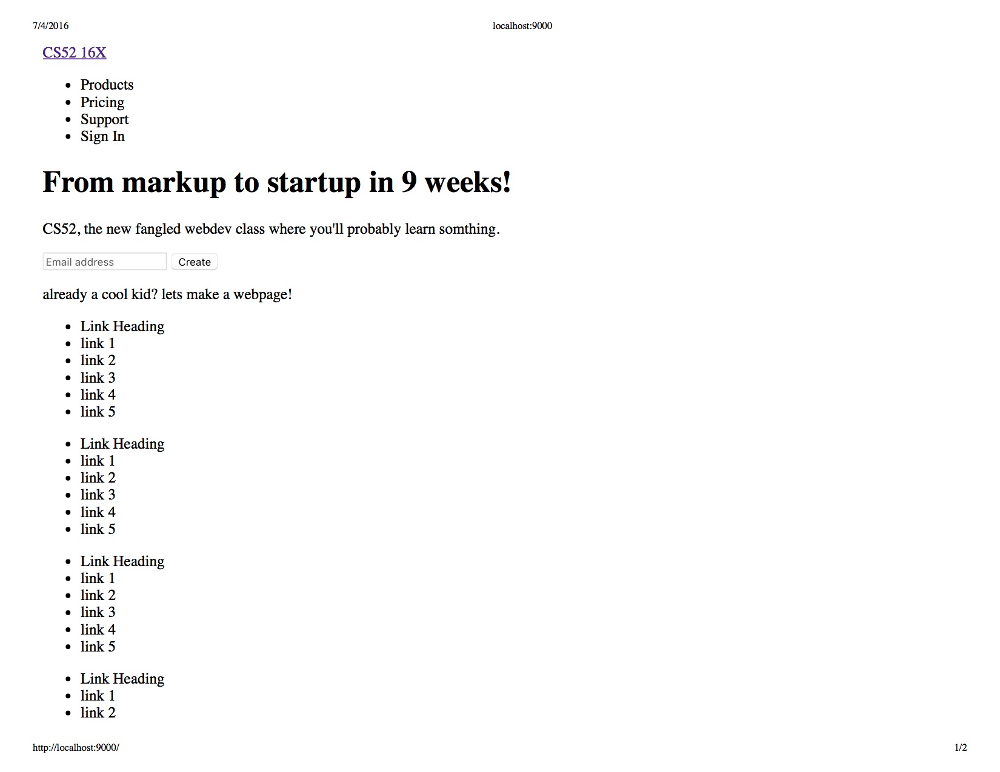
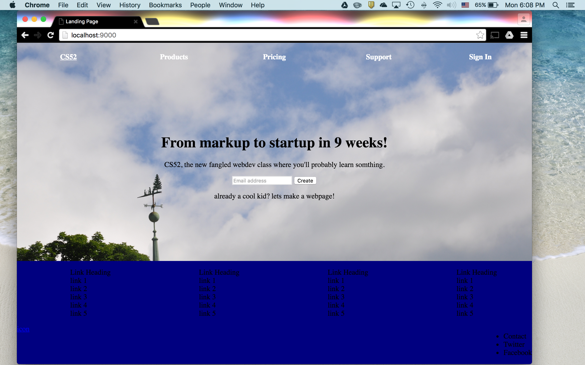
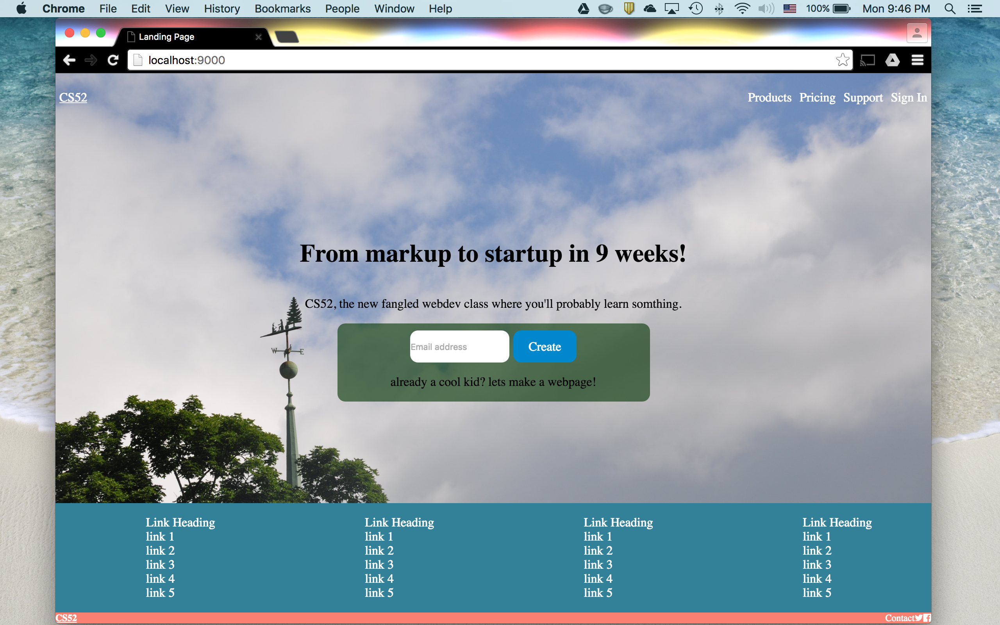

#Homework 1 - CS 52 16X - Benjamin Cooper#

This repository contains my first homework assignment, which is a landing page.  The landing page has no actual links, but rather, was created as an exercise in HTML/CSS web integration, and more specifically, FlexBox layout.

As I have never used CSS or HTML before (or FlexBox for that matter), I was quite happy with how my landing page turned out.  As is apparent in the screenshots documenting the earlier stages of my landing page, I was having a difficult time with the FlexBox layout, specifically, aligning the separate parts in a coherent fashion.  At first, I tried using only a couple boxes, but once I began using multiple boxes (each with internal boxes), I was able to better create a coherent layout.

The main aspect of the project in which I struggled was with the media query.  I was able to successfully get my landing page to resize, however, I could not get it to look exactly like our provided example (in terms of the more specific/individual) FlexBox re-sizing.

 
 
 
 
 
 
